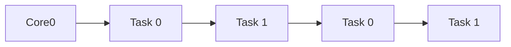
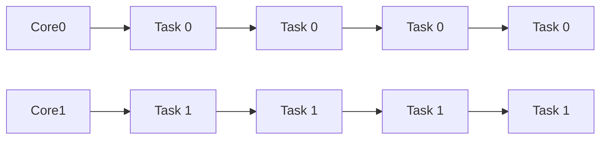

## 병렬성과 동시성
Event Loop를 보기 전에 미리 알고 가야 하는 개념이 있다. Parallelism(병렬성)과 Concurrency(동시성)이다. 동시성과 병렬성은 운영체제에서 나오는 개념인데, 다음과 같은 차이가 있다.

| 동시성(Concurrency) | 병렬성(Parallelism) |
|---|---|
| 여러 작업이 동시에 실행되는 것처럼 보이지만, 실제로는 번갈아 가며 실행됨 | 여러 개의 CPU 코어를 사용하여 여러 작업이 실제로 동시에 실행됨 |

**concurrency**
{: style="color:gray; font-size: 80%; text-align: center;"}



**Parallelism**
{: style="color:gray; font-size: 80%; text-align: center;"}


## Dart가 지원하는 건 동시성
아마 Dart 코드들을 조금 봤으면 느끼겠지만, 신기하게도 Dart 코드에는 lock이란 개념을 찾아볼 수 없다. 이는 Dart가 동시성을 이용한 Multitasking을 추구하기 때문이다.

### Dart의 실행 단위는 Isolate


Dart는 "Isolate"이라는 실행 단위를 가진다. 개발자가 특별히 `Isolate.spawn()`을 이용하지 않는 이상, 기본적으로 Dart는 하나의 Main Isolate으로만 동작한다.


Isolate은 하나의 Thread로만 실행된다. 즉, 기본적으로 Dart는 하나의 Main Isolate Thread로만 작업을 처리하고 있다는 뜻이다. 그럼에도 Flutter에서 dart는, http Request를 기다리는 동안 UI를 그리고, 사용자 input을 받으며, 현재 사용자의 지리적 위치 정보를 query 한다.


이걸 가능하게 하는 것이 Event Loop를 통해 구현된 Dart의 동시성이다.

### Event Loop를 이용하면 Single Thread 동시성이 가능하다.
Single Thread에서 동시성을 지원한다는 말은, Thread가 여러 Task들을 왔다갔다하며 처리한다는 뜻이다. 이게 어떻게 가능한 것일까?

Dart는 사용자의 화면 탭, http request 완료, setState()같은 repainting 요청... 등의 "Event"를 가진다. 그리고 각각의 Event에는 Event를 handling할 callback 함수들이 등록되어 있다. 각각의 Event는 발생순서대로 Queue에 쌓이게 되고, Isolate은 Event Queue에 쌓여있는 Event를 하나씩 꺼내서 callback 함수를 호출한다. 이 로직을 Event Loop라고 부른다.
```dart
// Event Loop 코드
while (eventQueue.waitForEvent()) {
  eventQueue.processNextEvent();
}
```


Dart는 처리해야할 작업들을 작은 Event라는 단위로 나눠서 쌓아두고, Event Loop를 통해 각각의 Event를 처리하는 방식으로 동시성을 작동시키는 것이다.