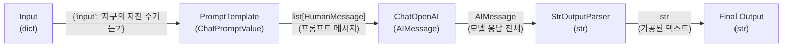

[Langchain 기반 챗봇 만들기 #1](/posts/chatbot_1/) 에서는 OpenAI API 키를 발급받아 기본 질문·응답 예제를 실행해 보았다. 그런데 단순한 요청-응답만으로는 이전 대화 내용을 참고하지 못해, 대화가 이어진다는 느낌이 들지 않는다.

이럴 때 필요한 도구가 바로 Langchain이다. Langchain은 단일 프롬프트 호출을 넘어, 대화 맥락을 유지하거나 외부 도구를 활용하는 파이프라인을 쉽게 구성할 수 있게 돕는다.

Langchain은 기능이 많아 처음 접할 때 개념이 다소 복잡하게 느껴졌다. 여기에 최대한 정리해놓도록 하려 한다.


## Langchain이란
> Langchain은 대형 언어 모델(LLM) 애플리케이션 개발을 돕는 파이썬 라이브러리다. 프롬프트 관리, 컨텍스트 유지, 외부 도구 연동 등 반복 작업을 추상화해 개발 생산성을 높여준다...

라고 적혀있다. 모르겠고 코드를 통해 보자.


## Runnable
LangChain은 말 그대로 ‘체인(chain)’ 방식으로 동작을 구성한다. 마치 파이프처럼 각 구성 요소를 연결하여, 한 요소의 출력(output)이 다음 요소의 입력(input)이 되도록 한다. 

이를 위해 Chain, Agent, Tool, Memory 등 주요 실행 단위는 Runnable 인터페이스를 구현하거나 래핑된 형태로 제공된다.

다음 예시코드에서는 직접 Runnable을 상속받아서 두 클래스를 제작했다.
```python
from langchain_core.runnables import Runnable

class AddOne(Runnable):
    def invoke(self, input: int, config=None, **kwargs):
        return input + 1        # (+1)

class MultiplyByTwo(Runnable):
    def invoke(self, input: int, config=None, **kwargs):
        return input * 2        # (×2)

chain = AddOne() | MultiplyByTwo() # 체이닝 – LCEL 파이프

print(chain.invoke(3))   # (3 + 1) * 2 → 8
```

`AddOne`: 입력값에 1을 더하는 연산

`MultiplyByTwo`: 입력값을 2배로 곱하는 연산

이 두 클래스를 파이프 연산자 `|`를 통해 연결했다. 이 방식은 앞에서 나온 출력이 자동으로 다음 입력으로 넘어가는 체이닝 구조를 만든다. 이러한 구조 덕분에 복잡한 LLM 파이프라인도 매우 직관적으로 표현할 수 있다.

```python
chain = AddOne() | MultiplyByTwo()
```
`invoke()` 메서드를 통해 전체 체인을 실행할 수 있으며, 이는 내부적으로 각 `Runnable`의 `invoke()`를 순차적으로 호출한다.


여기서 주의할 점은 `AddOne`이 input으로 integer형 변수 1개를 받기 때문에 `invoke()`에도 integer형 변수인 `3`을 넘겨주었다는 것이다.


## LLM, Prompt, Chain
그러면 위의 Runnable을 이용해서 각종 LLM을 어떻게 구동하는걸까?
LLM을 구동시키는 데는 크게 세 가지 구성 요소가 필요하다:
* **LLM**: 어떤 언어모델을 사용할 것인지
* **Prompt**: 언어모델에 어떤 입력을 줄 것인지 (예: "너는 LLM 전문가야. 아래 질문에 답해줘. 질문: {input}")
* **OutputParser**: 어떤 출력값을 원하는지 (예: 전체 응답에서 텍스트만 추출)

이 세 가지는 모두 Runnable로 동작하기 때문에, 앞서 봤던 파이프 연산자 `|`를 이용해 다음과 같이 쉽게 연결할 수 있다.

```python
from langchain_core.prompts import ChatPromptTemplate
from langchain_core.output_parsers import StrOutputParser
from langchain_openai import ChatOpenAI

# 프롬프트 템플릿 정의
prompt = ChatPromptTemplate.from_template(
    "너는 전문가야. 아래 질문에 답해줘.\n\n질문: {input}"
)

# 사용할 언어모델 지정
llm = ChatOpenAI(model="gpt-4.1-nano", openai_api_key="YOUR_API_KEY")

# 출력 결과를 문자열로 정리
output_parser = StrOutputParser()

# 체이닝: Prompt → LLM → OutputParser
chain = prompt | llm | output_parser

# 실행
print(chain.invoke({"input": "지구의 자전 주기는?"}))
```



실행해보면 다음과 같은 결과가 나온다.
```
지구의 자전 주기(즉, 지구가 자신을 한 바퀴 도는 시간)는 약 23시간 56분 4초입니다. 이를 "항성일(sidereal day)"이라고 하며, 태양을 기준으로 한 태양일(약 24시간)과는 약 4분 정도 차이가 있습니다. 태양일은 태양이 하늘에서 같은 위치에 다시 도달하는 데 걸리는 시간을 의미하며, 일상적으로 우리가 사용하는 하루는 이 태양일에 해당합니다.
```

prompt가 `{"input": "지구의 자전 주기는?"}` 같은 dict를 받으면, 그 안의 `"input"` 값을 템플릿의 `{input}` 자리에 자동으로 치환해서 LLM 호출용 메시지를 완성해준다.

---


## PromptTemplate 주요 종류

| 분류               | 대표 클래스                     | 한 줄 설명                                    |
|------------------|-----------------------------|-------------------------------------------|
| 문자열 프롬프트        | `PromptTemplate`             | f-string·Jinja2 등으로 LLM 입력 문자열 생성 |
| 대화형 프롬프트        | `ChatPromptTemplate`         | 시스템·사용자·AI 메시지를 묶어 대화 맥락 구성 |
| 메시지 자리표시        | `MessagesPlaceholder`        | 기존 메시지 리스트를 그대로 삽입(메모리 연동) |
| Few-Shot 프롬프트 | `FewShotPromptTemplate` 등   | I/O 예시를 접두·접미로 배치해 few-shot 학습 |

> 이외에도 `PipelinePromptTemplate`, `StructuredChatPromptTemplate` 등 다양한 고급 템플릿을 제공한다.


## LLM 래퍼 주요 종류

| 클래스명        | 비고(필요 패키지·API) |
|---------------|-------------------|
| `ChatOpenAI`  | `openai` 패키지, GPT 계열 |
| `ChatAnthropic` | Claude 계열 |
| `ChatGoogleVertexAI` (`ChatGooglePalm` 구 버전) | Vertex AI, PaLM-2/Gecko 등 |
| `ChatCohere`  | Cohere Command-R 등 |

> LiteLLM, Ollama 등 로컬·프록시형 래퍼도 다수 존재한다.


## OutputParser 주요 종류

| 클래스명                | 용도                                  |
|----------------------|-------------------------------------|
| `StrOutputParser`    | 전체 응답을 문자열로 반환(가장 기본)          |
| `JSONOutputParser`   | JSON 형태 응답을 딕셔너리로 파싱            |
| `PydanticOutputParser` | 결과를 Pydantic 모델 인스턴스로 변환 |

> 이외에 `RegexOutputParser`, `CommaSeparatedListOutputParser` 등 특수 목적 파서도 제공된다.

---

## RunnableLambda로 커스텀 처리 단계 추가하기
만약 나만의 Custom 로직을 추가하고 싶다면?

[`Runnable`](#runnable)을 직접 상속하여 클래스를 구현하는 방법도 있지만, `RunnableLambda`를 이용하면 더 간단하게 사용자 정의 단계를 체인에 삽입할 수 있다.

```python
from langchain_core.prompts import ChatPromptTemplate
from langchain_core.prompt_values import ChatPromptValue
from langchain_core.runnables import RunnableLambda
from langchain.schema import HumanMessage, BaseMessage

# 1) Prompt와 LLM 정의
prompt = ChatPromptTemplate.from_template(
    "질문에 친절히 답할게요:\n\n{input}"
)

# 2) ChatPromptValue를 받아 HumanMessage에 '?' 추가하는 단순 함수
def emphasize_question_fn(pv: ChatPromptValue) -> ChatPromptValue:
    msgs: list[BaseMessage] = pv.to_messages()
    new_msgs: list[BaseMessage] = []
    for m in msgs:
        if isinstance(m, HumanMessage):
            # 사용자 메시지 앞뒤에 물음표 이모지 추가
            content = f"? {m.content.strip()} ?"
            new_msgs.append(HumanMessage(content=content))
        else:
            new_msgs.append(m)
    return ChatPromptValue(messages=new_msgs)

# 3) RunnableLambda로 래핑
normalize_input = RunnableLambda(emphasize_question_fn)

# 4) 체인: prompt → normalize_input → llm
chain = prompt | normalize_input

# 5) 실행 예시
print(chain.invoke({"input": "지구의 자전 주기는?"}))
```

```
# 실행결과
messages=[HumanMessage(content='? 질문에 친절히 답할게요:\n\n지구의 자전 주기는? ?', additional_kwargs={}, response_metadata={})]
```

> `RunnableLambda`는 주로 데이터 전처리, 형 변환, 로깅 등의 목적에 활용되며 체인의 유연성을 크게 높여준다.
