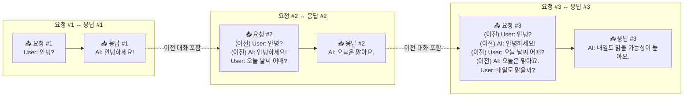

[Langchain 기반 챗봇 만들기 #2](/posts/chatbot_2/) 에서는 기본 Langchain 개념과 사용법을 살펴보았다. 이제는 memory 요소를 통해 챗봇이 이전 대화 문맥을 유지하도록 해보자.

## 대화 문맥
기본적으로 OpenAI에서 제공하는 API는 **비상태(stateless)** 방식이다. 이전 대화 문맥을 기억하지 않고, 이번 API 호출에 포함된 입력만을 기준으로 응답을 생성한다.

그렇다면 챗봇들은 어떻게 대화 문맥을 유지할까?

답은 아주 단순하다.

**API 요청 시, 이전 대화 내용을 함께 포함하여 보내면 된다.**



위처럼 매 요청마다 이전 대화 내역을 누적해서 보내는 방식이다.

Langchain에서는 이 번거로운 과정을 **`Memory` 모듈**로 추상화해 둔다. 그중에서도 가장 단순한 구현이 **`ConversationBufferMemory`** 다.

## `ConversationBufferMemory`로 파이프라인 만들기
ConversationBufferMemory는 단순히 모든 이전 대화 기록을 순서대로 저장하고, 다음 프롬프트 호출 시 이 기록을 자동으로 전달해준다.


### 전체 코드
예를 들어 다음과 같이 사용할 수 있다:
```python
from operator import itemgetter
from langchain_core.prompts import ChatPromptTemplate, MessagesPlaceholder
from langchain_openai import ChatOpenAI
from langchain.memory import ConversationBufferMemory
from langchain_core.runnables import RunnableLambda, RunnablePassthrough

# 1. LLM 모델 정의
llm = ChatOpenAI(model="gpt-4.1-nano")

# 2. Memory 정의
memory = ConversationBufferMemory(memory_key="chat_history", return_messages=True)

# 3. Prompt 정의 (이전 대화 내역 포함)
prompt = ChatPromptTemplate.from_messages([
    ("system", "당신은 친절한 AI 비서입니다."),
    MessagesPlaceholder(variable_name="chat_history"),
    ("human", "{input}")
])

# 4. 체이닝 구성
chain = (
    # ① 입력 dict에 과거 대화 기록(chat_history) 붙이기
    RunnablePassthrough.assign(
        chat_history = (
            RunnableLambda(lambda _: memory.load_memory_variables({}))
            | itemgetter("chat_history")
        )
    )
    # ② 프롬프트 → LLM → response 필드 추가
    | RunnablePassthrough.assign(
        response = prompt | llm
    )
    # ③ 메모리에 저장하고 response만 내보내기
    | RunnableLambda(lambda d: (
        memory.save_context(
            {"input":  d["input"]},
            {"output": d["response"].content}
        ) or d["response"]
    ))
)

# 5. 체인 실행
print(chain.invoke({"input": "안녕? 나는 홍길동이야."}).content)
print(chain.invoke({"input": "내 이름이 뭐라고?"}).content)

```

### 실행 결과 (예시)
```
안녕하세요, 홍길동님. 무엇을 도와드릴까요?
당신의 이름은 홍길동입니다.
```

### 데이터가 흐르는 순서

| 단계 | Runnable 단계                                            | 입력 딕셔너리 → 출력 딕셔너리                                                                                            | 역할                                                                                                              |
| -- | ------------------------------------------------------ | ------------------------------------------------------------------------------------------------------------ | --------------------------------------------------------------------------------------------------------------- |
| ①  | `RunnablePassthrough.assign(chat_history=…)`           | `{"input": "..."}` → `{"input": "...", "chat_history": [...]}`                                               | 현재 입력 dict에 **`chat_history`** 키를 추가한다. 값은 `ConversationBufferMemory.load_memory_variables()`가 돌려준 과거 메시지 리스트다. |
| ②  | `RunnablePassthrough.assign(response = prompt \| llm)` | `{"input": "...", "chat_history": [...]}` → `{"input": "...", "chat_history": [...], "response": AIMessage}` | 프롬프트를 완성해 LLM을 호출하고, 얻은 `AIMessage`를 `response` 키에 저장한다.                                                        |
| ③  | `RunnableLambda(save_context…)`                        | 위 딕셔너리 → `AIMessage`                                                                                         | `memory.save_context()`로 **사용자‑AI 메시지 쌍을 버퍼에 push**하고, 마지막에는 `AIMessage`만 반환한다.                                 |

> **왜 Passthrough를 쓰나?**
> `RunnablePassthrough.assign`은 "딕셔너리를 그대로 전달하면서 새 키를 덧붙이는" 데 최적화된 유틸이다. 이렇게 하면 중간 단계에서 원본 데이터를 잃지 않고 필요한 필드를 점진적으로 누적할 수 있다.

#### `memory.load_memory_variables({})`이 반환하는 구조

```python
{
    "chat_history": [
        HumanMessage(content="안녕? 나는 홍길동이야."),
        AIMessage(content="안녕하세요, 홍길동님. 무엇을 도와드릴까요?")
    ]
}
```

* **키 이름**은 `memory_key="chat_history"`와 1:1로 대응해야 한다.
* `return_messages=True` 옵션 덕분에 순수 문자열이 아니라 **Message 객체** 목록으로 돌려준다. 따라서 프롬프트에 그대로 삽입해도 형식 오류가 나지 않는다.


### 이렇게 쓰면 좋은 경우 vs. 주의할 점

**장점**

* 구현 난이도가 매우 낮다 — 몇 줄 만에 "기억하는 챗봇" 완성.
* LLM이 모든 과거 대화를 보므로 맥락 일관성이 뛰어나다.

**단점**

* 대화 기록이 길어질수록 토큰 비용이 선형으로 증가한다.
* 길이 제한(예: 128k)을 넘기면 오류가 발생하거나 맨 앞 메시지가 잘릴 수 있다.

### 대안

* `ConversationTokenBufferMemory` : 토큰 수 기준으로 슬라이딩 윈도우 유지.
* `SummaryMemory` : 오래된 대화를 LLM이 요약하여 짧은 한 문장으로 대체.

