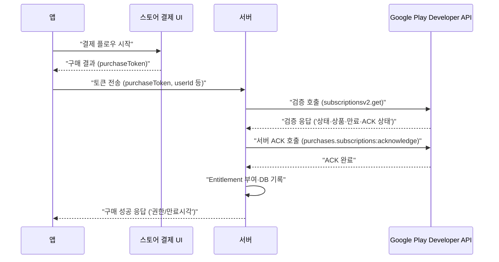
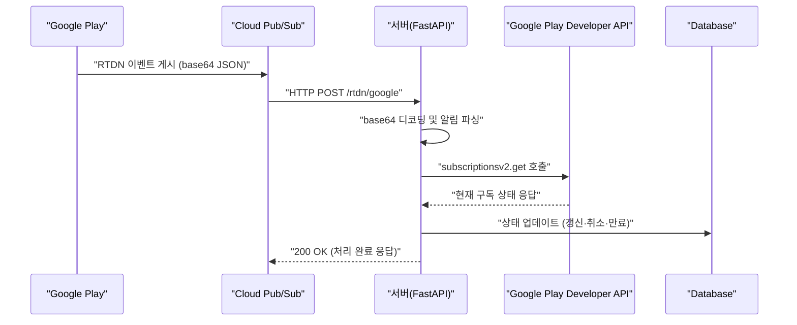

> 이 글은 ChatGPT가 작성한 초안을 바탕으로, 직접 테스트 및 검증을 거쳐 수정·보완한 내용입니다.

## 동작 방식 간단 리뷰



* 결제 직후 앱은 **purchaseToken** 을 서버로 보냄 → 서버가 **Developer API**로 검증하고 필요 시 **ACK** 처리(구독 인정).

---

## Google Play Developer API 설정 

검증·ACK용으로 service account를 발급 받아야 합니다. 

서버는 해당 account 권한으로 검증·ACK 호출을 수행합니다.

### 1-1. GCP 프로젝트 & API 활성화

1. **Google Cloud Console** → 프로젝트 선택/생성
2. **Google Play Developer API** 활성화(API Library에서 Enable)


### 1-2. 서비스 계정 만들기 & JSON 키 발급

1. **IAM & Admin → Service Accounts → Create service account**


> 서비스 계정 이름(Service Account Name) 은 완전히 자유롭게 지정할 수 있지만, 운영 목적을 명확히 드러내는 규칙적 네이밍이 좋습니다. (ex. play-billing-verifier)


여기서 생성된 이메일을 기억해야합니다.

2. **Keys → Add key → Create new key → JSON** (서버가 사용할 “키” 파일)


### 1-3. Play Console에 서비스 계정 “사용자”로 초대

1. **Play Console → Users & permissions → Invite new users**


2. **서비스 계정 이메일**(`...@...iam.gserviceaccount.com`)을 입력
3. 권한 부여(앱 단위 또는 전체):

   * **Manage orders and subscriptions**,
   * **View financial data, orders, and cancellation survey responses** 선택


초대 완료 후 실제 반영까지 약 5~10분 정도 지연될 수 있습니다.

---

## FastAPI 예시 코드

### 2-1. 의존성

```bash
pip install fastapi uvicorn google-auth google-api-python-client google-auth-httplib2 pydantic[dotenv] httpx
```

### 2-2. 환경 변수

* `GOOGLE_APPLICATION_CREDENTIALS`: 서비스 계정 JSON 파일 경로(또는 런타임에 직접 로딩).

### 2-3. 예시 코드

```python
# app.py
from fastapi import FastAPI, HTTPException
from pydantic import BaseModel
from typing import Optional
import os

from google.oauth2 import service_account
from googleapiclient.discovery import build
from googleapiclient.errors import HttpError

SCOPES = ["https://www.googleapis.com/auth/androidpublisher"]  # DevAPI 권한 스코프

app = FastAPI(title="IAP Verify API")

class VerifyReq(BaseModel):
    package_name: str
    purchase_token: str
    user_id: Optional[str] = None  # 내부 매핑용(선택)

def _android_publisher():
    # 1) 서비스 계정 자격
    cred_path = os.environ.get("GOOGLE_APPLICATION_CREDENTIALS")
    if not cred_path or not os.path.exists(cred_path):
        raise RuntimeError("GOOGLE_APPLICATION_CREDENTIALS not set or file missing")
    creds = service_account.Credentials.from_service_account_file(
        cred_path, scopes=SCOPES
    )
    # 2) 클라이언트 생성
    return build("androidpublisher", "v3", credentials=creds, cache_discovery=False)

def _get_sub_purchase(pub, package_name, token):
    # subscriptionsv2.get: 구독의 권위 상태 조회
    # 응답: SubscriptionPurchaseV2 (acknowledgementState, subscriptionState, lineItems[0].productId 등)
    return pub.purchases().subscriptionsv2().get(
        packageName=package_name, token=token
    ).execute()  # :contentReference[oaicite:10]{index=10}

def _acknowledge_if_needed(pub, package_name, token, product_id):
    # 서버 ACK (중복 금지; 이미 ACK이면 생략)
    try:
        pub.purchases().subscriptions().acknowledge(  # :contentReference[oaicite:11]{index=11}
            packageName=package_name,
            subscriptionId=product_id,
            token=token,
            body={"developerPayload": "server-ack-v1"}
        ).execute()
        return True
    except HttpError as e:
        # 이미 ACK된 경우 등은 무시(409/400일 수 있음). 동시에 클라도 ACK하면 충돌 가능. :contentReference[oaicite:12]{index=12}
        return False

@app.post("/iap/google/verify")
def verify(req: VerifyReq):
    pub = _android_publisher()

    try:
        v2 = _get_sub_purchase(pub, req.package_name, req.purchase_token)
    except HttpError as e:
        # 잘못된 토큰/권한 등
        raise HTTPException(status_code=400, detail=f"verify_failed: {e}")

    ack_state = v2.get("acknowledgementState")  # "ACKNOWLEDGEMENT_STATE_PENDING" | "ACKNOWLEDGEMENT_STATE_ACKNOWLEDGED"
    sub_state = v2.get("subscriptionState")     # "SUBSCRIPTION_STATE_ACTIVE" 등
    product_id = None
    try:
        product_id = (v2.get("lineItems") or [{}])[0].get("productId")
    except Exception:
        pass

    # 서버 ACK 권장: 아직 PENDING이면 ACK 시도
    did_ack = False
    if ack_state != "ACKNOWLEDGEMENT_STATE_ACKNOWLEDGED" and product_id:
        did_ack = _acknowledge_if_needed(pub, req.package_name, req.purchase_token, product_id)

        # ACK 후 재조회로 상태 확정
        try:
            v2 = _get_sub_purchase(pub, req.package_name, req.purchase_token)
            ack_state = v2.get("acknowledgementState")
            sub_state = v2.get("subscriptionState")
        except HttpError:
            pass

    # 여기서 Entitlement/DB 처리 (예: ACTIVE면 부여, 만료일 등 라인아이템 참고)
    # save_subscription(user_id=req.user_id, product_id=product_id, state=sub_state, raw=v2) ...

    return {
        "ok": True,
        "acknowledgementState": ack_state,
        "subscriptionState": sub_state,
        "productId": product_id,
        "didServerAck": did_ack
    }
```

---

## Flutter 예시 코드

### 3-1. 의존성

```yaml
# pubspec.yaml
dependencies:
  in_app_purchase: ^3.2.3
  http: ^1.2.0
```

### 3-2. 예시 코드(핵심만)

```dart
// iap_test_page.dart
import 'dart:async';
import 'dart:convert';
import 'dart:io' show Platform;

import 'package:flutter/material.dart';
import 'package:in_app_purchase/in_app_purchase.dart';
import 'package:http/http.dart' as http;

class IapTestPage extends StatefulWidget {
  const IapTestPage({super.key});

  @override
  State<IapTestPage> createState() => _IapTestPageState();
}

class _IapTestPageState extends State<IapTestPage> {
  final InAppPurchase _iap = InAppPurchase.instance;

  // 실제 콘솔과 동일한 상품 ID이어야 함!
  static const Set<String> productIds = {
    'premium_subscription',
  };

  late StreamSubscription<List<PurchaseDetails>> _sub;
  List<ProductDetails> _products = [];
  String _status = '초기화 중...';

  // 서버 검증 URL (너의 FastAPI 엔드포인트)
  final String verifyUrl = 'https://api.example.com/iap/google/verify';

  @override
  void initState() {
    super.initState();
    _initIap();
  }

  Future<void> _initIap() async {
    try {
      final available = await _iap.isAvailable();
      if (!available) {
        setState(() => _status = '스토어 사용 불가(테스트 계정/설치 경로 확인)');
        return;
      }

      // 구매 스트림 구독
      _sub = _iap.purchaseStream.listen(_onPurchases, onDone: () => _sub.cancel());

      // 상품 조회
      final resp = await _iap.queryProductDetails(productIds);
      if (resp.error != null) {
        setState(() => _status = '상품 조회 에러: ${resp.error}');
        return;
      }
      if (resp.productDetails.isEmpty) {
        setState(() => _status = '상품이 없습니다(상품ID/트랙/배포 확인)');
        return;
      }
      setState(() {
        _products = resp.productDetails;
        _status = '상품 로드 완료';
      });
    } catch (e) {
      setState(() => _status = '초기화 실패: $e');
    }
  }

  @override
  void dispose() {
    _sub.cancel();
    super.dispose();
  }

  Future<void> _onPurchases(List<PurchaseDetails> list) async {
    for (final p in list) {
      if (p.status == PurchaseStatus.purchased || p.status == PurchaseStatus.restored) {
        final token = p.verificationData.serverVerificationData;
        setState(() => _status = '서버 검증 중... (token=${token.isEmpty ? "EMPTY" : "OK"})');

        try {
          final res = await http.post(
            Uri.parse(verifyUrl),
            headers: {'Content-Type': 'application/json'},
            body: jsonEncode({
              'package_name': 'com.example.app', // 실제 패키지명으로 교체
              'purchase_token': token,
              'user_id': 'testUser123',
            }),
          );

          final data = jsonDecode(res.body);
          final ackState = data['acknowledgementState'];
          final subState = data['subscriptionState'];
          final didServerAck = data['didServerAck'] == true;

          setState(() => _status =
              '서버 응답: sub=$subState, ack=$ackState, didServerAck=$didServerAck');

          // 권한 부여(로컬 표시): 운영에선 서버 응답을 신뢰
          if (res.statusCode == 200 && subState == 'SUBSCRIPTION_STATE_ACTIVE') {
            // 여기서 Premium UI 해금 등
          }

          // ACK 중복 방지: 서버 ACK을 쓴 경우 Android는 생략 가능
          if (p.pendingCompletePurchase) {
            final shouldCompleteOnAndroid = !(Platform.isAndroid &&
                ackState == 'ACKNOWLEDGEMENT_STATE_ACKNOWLEDGED' &&
                didServerAck);

            if (!Platform.isAndroid || shouldCompleteOnAndroid) {
              await _iap.completePurchase(p);
              setState(() => _status += ' | completePurchase 호출');
            } else {
              setState(() => _status += ' | completePurchase 생략(서버 ACK)');
            }
          }
        } catch (e) {
          setState(() => _status = '서버 검증 실패: $e');
        }
      } else if (p.status == PurchaseStatus.error) {
        setState(() => _status = '구매 에러: ${p.error}');
      } else if (p.status == PurchaseStatus.pending) {
        setState(() => _status = '구매 진행 중...');
      }
    }
  }

  Future<void> _buy(ProductDetails pd) async {
    final param = PurchaseParam(productDetails: pd);
    await _iap.buyNonConsumable(purchaseParam: param); // 구독은 non-consumable 플로우 사용
  }

  @override
  Widget build(BuildContext context) {
    return Scaffold(
      appBar: AppBar(title: const Text('IAP 테스트')),
      body: Padding(
        padding: const EdgeInsets.all(16),
        child: Column(
          children: [
            Text(_status),
            const SizedBox(height: 16),
            if (_products.isEmpty)
              const Text('표시할 상품이 없습니다')
            else
              Expanded(
                child: ListView.separated(
                  itemCount: _products.length,
                  separatorBuilder: (_, __) => const Divider(),
                  itemBuilder: (_, i) {
                    final p = _products[i];
                    return ListTile(
                      title: Text('${p.title}'),
                      subtitle: Text('${p.description}\n가격: ${p.price} (${p.id})'),
                      isThreeLine: true,
                      trailing: ElevatedButton(
                        onPressed: () => _buy(p),
                        child: const Text('구매'),
                      ),
                    );
                  },
                ),
              ),
          ],
        ),
      ),
    );
  }
}

```

> 위 코드에서 상품 ID로 **premium_subscription**을 사용했다는 것을 주의하세요. Google Play Console에서 구독 상품 id를 동일하게 맞춰주어야 합니다.
{: .prompt-info}

---

## Google Play Console 결제 환경 구성 및 테스트

테스트 결제는 실제 결제 없이 **내부 테스트 트랙과 라이선스 테스트 계정**을 이용해 전 과정을 검증할 수 있습니다.

---

### 4-1. 테스트 트랙(App Bundle 업로드)

1. **Play Console → “내부 테스트 트랙(Internal testing)”**
   → `Create new release` 또는 기존 트랙 선택
2. **`.aab` 업로드** (release 빌드, 서명 필수)
3. **테스터 계정 추가**
   → “테스트 참여자 추가” 버튼을 눌러 Google 계정(Gmail) 등록
4. 저장 후 **배포 링크(URL)** 생성
   → 이 링크를 통해 테스터가 Play 스토어에서 앱을 설치해야 함
   *(APK 직접 설치는 안 됨 — Play Store 앱을 통해 설치해야 Billing 연결이 인증됨)*

---

### 4-2. 라이선스 테스트 계정 등록

1. **Play Console 홈 → 설정(Settings) → 라이선스 테스트(License testing)**
2. 테스트용 Gmail 계정 추가 (위 트랙에 사용하는 동일한 계정)
   → 이 계정으로 Play Store에 로그인해야 테스트 결제 UI가 활성화됨
3. 등록 후 바로 반영되지만, 반영이 늦으면 로그아웃 후 재로그인


---

### 4-3. 테스트 앱 설치 및 테스트
1. 내부테스트 -> 테스터 탭 선택 -> 웹에서 참여 링크를 복사하여 앱 설치
2. 구매 버튼을 눌러 구독 시작

정상적으로 동작했다면 다음과 같이 표시됩니다.


---

## Google Play 실시간 구독 알림 (RTDN) 설정

구독이 갱신되거나 취소·만료될 때마다 서버가 자동으로 이를 감지하려면
**Real-Time Developer Notifications (RTDN)** 기능을 활성화해야 합니다.
Google Play → Cloud Pub/Sub → 서버로 이벤트가 전달되는 구조입니다.



---

### 5-1. Cloud Pub/Sub 설정

#### ① API 활성화

1. [Google Cloud Console](https://console.cloud.google.com)
2. **Pub/Sub API** 검색 → **Enable**


#### ② 토픽(Topic) 생성

1. **Pub/Sub → Topics → Create topic**
2. ID: `rtdn-notifications` 등
3. 생성 후 표시되는 전체 경로를 복사해둡니다.


   ```
   projects/<PROJECT_ID>/topics/rtdn-notifications
   ```

#### ③ 권한 부여

1. 생성한 토픽 → **Permissions** 탭 → **Add principal**

2. 아래 이메일을 추가하고 **Pub/Sub Publisher** 역할 부여
   ```
   google-play-developer-notifications@system.gserviceaccount.com
   ```
   
3. 저장 후 1~2분 정도 기다리면 반영됩니다.

> 이 과정을 통해 Google Play가 해당 토픽으로 알림 메시지를 발행할 수 있게 됩니다.
{: .prompt-info}

#### ④ 구독(Subscription) 생성

1. 토픽 상세 페이지 → **Create subscription**

2. ID: `rtdn-subscription`
3. **Delivery type**: Push
4. **Push endpoint URL**:

   ```
   https://{서버도메인}/rtdn/google
   ```
5. 나머지는 기본값 그대로 두고 **Create**

---

### 5-2. Play Console 연결

1. [Play Console](https://play.google.com/console) → 앱 선택
2. **Monetize → Monetization setup → Real-time developer notifications**
3. **Enable real-time notifications** 체크
4. Topic name 입력:

   ```
   projects/<PROJECT_ID>/topics/rtdn-notifications
   ```
5. **Save changes**

6. **Send test message** 버튼으로 연결 성공 여부를 확인합니다.

---

### 5-3. 서버 구현 (FastAPI 예시)

아래 코드는 Pub/Sub이 전송한 RTDN 알림을 받는 `/rtdn/google` 엔드포인트 예시입니다.
알림 본문은 base64 인코딩된 JSON이므로, 디코딩 후 구독 상태를 다시 조회해야 합니다.

```python
# iap/rtdn.py
from fastapi import APIRouter, Request, HTTPException
import base64, json
from google.oauth2 import service_account
from googleapiclient.discovery import build

router = APIRouter()
SCOPES = ["https://www.googleapis.com/auth/androidpublisher"]

def _android_publisher():
    creds = service_account.Credentials.from_service_account_file(
        "service-account.json", scopes=SCOPES
    )
    return build("androidpublisher", "v3", credentials=creds, cache_discovery=False)

@router.post("/rtdn/google")
async def handle_rtdn(req: Request):
    body = await req.json()
    msg = body.get("message")
    if not msg or "data" not in msg:
        raise HTTPException(status_code=400, detail="invalid format")

    decoded = base64.b64decode(msg["data"]).decode()
    data = json.loads(decoded)

    if "subscriptionNotification" not in data:
        return {"ok": True, "msg": "ignored (non-subscription event)"}

    n = data["subscriptionNotification"]
    purchase_token = n["purchaseToken"]
    notif_type = n["notificationType"]

    pub = _android_publisher()
    result = pub.purchases().subscriptionsv2().get(
        packageName=data["packageName"], token=purchase_token
    ).execute()

    # 구독 상태(result["subscriptionState"])에 따라 DB 업데이트 수행
    # 예: ACTIVE → 활성화, CANCELED/EXPIRED → 권한 회수 등

    return {"ok": True, "notificationType": notif_type}
```

> RTDN은 “상태 변경”만 알리므로, 반드시 `subscriptionsv2.get`으로 **실제 구독 상태를 재조회**해야 합니다.
> {: .prompt-info}

---
